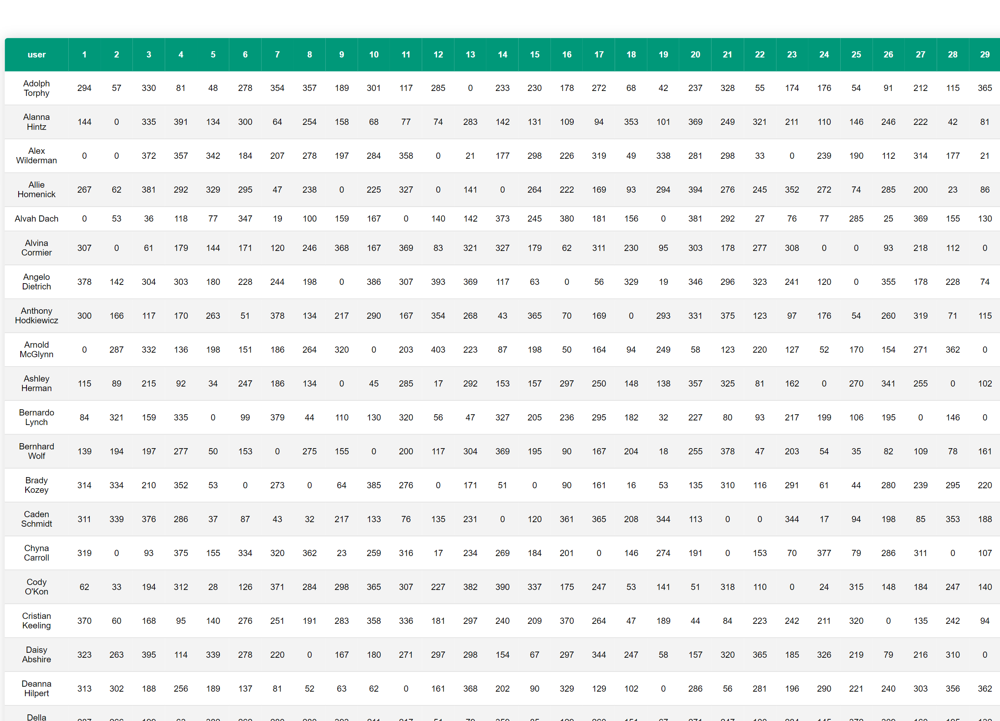
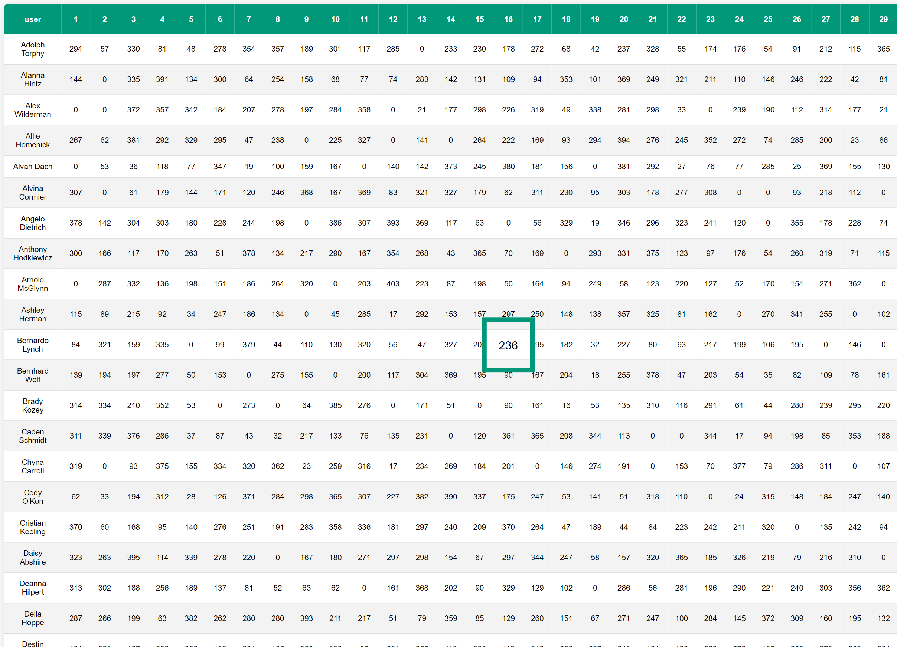

## Used technologies
    - React 
    - uuid
    - SCSS

### Screenshots

 The calendar app, which shows users spent time every day and total time during the month

 ## Installation instruction
    You must clone the repo:
     git clone https://github.com/rryaboshtan/ReactUsersSpentTimeCalendar.git

     And input in the command line
        cd ReactUsersSpentTimeCalendar/
        npm i            

    Then type in the VSCode or other command line 
     npm start
